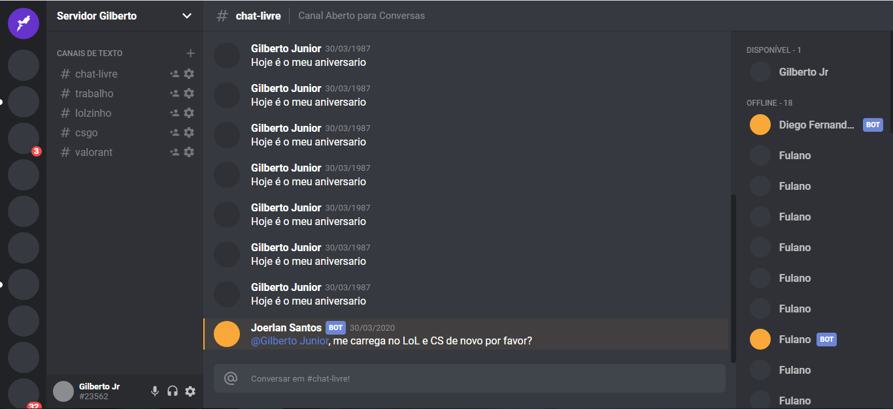

# Interface Discord com ReactJs | UI Clone

# 📔 Sobre

Reacriando a interface do discord [Discord](https://discord.com/channels/@me) com o ReackJs.

---
# 🌎 API
## API Desenvolvida com: 

    ReactJS
    -   Foi usado o --template=typescript

---

## Dependências: 

    styled-components,
    styled-icons,
    typescript,

---

## Dependências de Desenvolvimento: 
     devDependencies: {
        @types/styled-components
    }

---

## Após fazer o clone do projeto, no diretório do projeto, você pode executar: 

### `npm start` ou `yarn start`

Ao executar o aplicativo, o projeto vai abrir automaticamente no endereço http://localhost:3000.

Qualquer edição que você fizer no arquivo, a página sera recarregada.

Você também verá os erros no console.

---

## 💻 Web

---
<h1 align="center">💻 Desenvolvido Por: Gilberto Júnior</h1> 